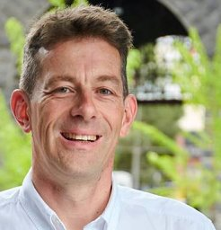

# Overview
# Motivation and Challenges
# Organizers

<table>
  <tr>
    <td></td>
    <td></td>
    <td></td>
    <td></td>
  </tr>
  <tr>
    <td>
      
Evangelos Kanoulas

      
University of Amsterdam, The Netherlands

    </td>
    <td>
      
Panagiotis Eustratiadis

      
University of Amsterdam, The Netherlands

    </td>
    <td>
      
Mark Sanderson

      
RMIT University, Australia

    </td>
    <td>
      
Jamie Callan

      
Carnegie Mellon University, USA

    </td>
  </tr>
</table>
